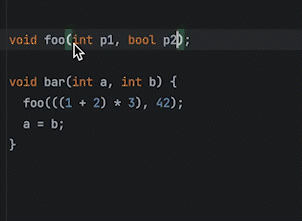

alfred-swap-around-symbols
==========================

Alfred workflow to quickly swap text around symbols used in programming: equal/assign `=`, binary operators `+-*/<>`,
comma `,` and colon `:`. Useful for refactoring. Support nested brackets.

Requirement: python3.

Download the alfredworkflow file from [release](https://github.com/liuzikai/alfred-swap-around-symbols/releases/latest).

## License
[GLWTPL (Good Luck With That Public License)](https://github.com/me-shaon/GLWTPL)

Icon reference: [1369049 - Noun Project](https://thenounproject.com/icon/swap-1369049/), reworked.